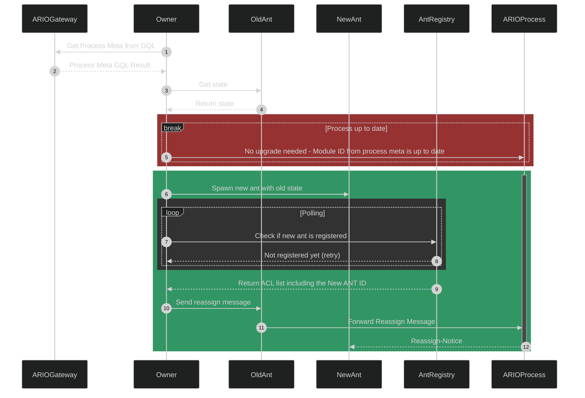

```mermaid
---
config:
  theme: dark
---
sequenceDiagram
    autonumber

    participant ARIOGateway
    participant Owner
    participant OldAnt
    participant NewAnt
    participant AntRegistry
    participant ARIOProcess


    Owner ->> ARIOGateway: Get Process Meta from GQL
    ARIOGateway -->> Owner: Process Meta GQL Result
    Owner->>OldAnt: Get state
    OldAnt-->>Owner: Return state

    rect rgb(150,50,50)
    break Process up to date
    Owner ->> ARIOProcess: No upgrade needed - Module ID from process meta is up to date
    end

    end
   rect rgb(50,150,100)
   activate ARIOProcess
    Owner->>NewAnt: Spawn new ant with old state
    rect rgb(50,50,50)
    loop Polling
        Owner->>AntRegistry: Check if new ant is registered
        AntRegistry-->>Owner: Not registered yet (retry)
    end
    end
    AntRegistry-->>Owner: Return ACL list including the New ANT ID
    Owner->>OldAnt: Send reassign message
    OldAnt->>ARIOProcess: Forward Reassign Message
    ARIOProcess-->>NewAnt: Reassign-Notice
    deactivate ARIOProcess
    end
```
