# Reassigning ANTs as Evolve/Upgrade Mechanism

- Status: Proposed
- Approvers: [Ariel], [Dylan], [Atticus], [Phil], [David]
- Date: [2025-01-30]
- Authors: [Atticus]

## Context and Problem Statement

Currently to evolve the ANT we use AOS `Eval` - this introduces the problem of
evaluating what the current version of the code is. If we maintain a variable in
the state of the process containing a version number, that tells us only what
that version number is. At any point the user - owner - of the ANT may `Eval`
new code into the process resulting in changes to the process that may not
reflect what we expect the version number we assigned to reflect. To overcome
this we currently use dryrun interactions on APIs and analyze the results to see
if the APIs perform as expected - this is very inefficient as dry run calls to
CU's are expensive in networking client side, as well as for the CU.

## Decision Drivers

- Improve the performance of ANT loading client side.
- Ensure the upgrade process is more robust by using immutable versioning, such
  as module IDs.
- Reduce computational load on CU infra.
- Mitigate risks associated with reassigning ANT state and ARNS records.

## Considered Options

1. **Current Approach (Baseline)**
   - Multiple dry runs per ANT.
   - ETH compatibility checked via handler analysis.
   - Upgrade involves loading Lua code.
2. **Leverage Re-Assign Name and \_boot capabilites to upgrade ANTs**
   - Use the module ID to evaluate process version.
   - Upgrade via spawning a new ANT and reassigning ARNS records.

## Decision Outcome

### Chosen Option: **Leverage Re-Assign Name and \_boot capabilites to upgrade ANTs**

With the ARIO process now supporting
[`Reassign-Name`](https://github.com/ar-io/ar-io-ant-process/pull/26) and recent
additions to add [`_boot`](https://github.com/ar-io/ar-io-ant-process/pull/57)
to fork the process state to a whole new ANT, we can assign that new ANT as the
registered ANT to the specified ArNS name in the registry, and using the module
ID of the process to identify process version and capabilities, and solely the
module ID.

This optimized approach reduces computational overhead and improves caching for
better performance. It also shifts to a more robust upgrade mechanism using
immutable module IDs rather than version detection heuristics. We can do this
now that we compile and publish our own WASM binaries, rather than using an AOS
binary and loading our code into it.

```mermaid
---
config:
  theme: dark
---
sequenceDiagram
    autonumber

    participant ARIOGateway
    participant Owner
    participant OldAnt
    participant NewAnt
    participant AntRegistry
    participant ARIOProcess


    Owner ->> ARIOGateway: Get Process Meta from GQL
    ARIOGateway -->> Owner: Process Meta GQL Result
    Owner->>OldAnt: Get state
    OldAnt-->>Owner: Return state

    rect rgb(150,50,50)
    break Process up to date
    Owner ->> ARIOProcess: No upgrade needed - Module ID from process meta is up to date
    end

    end
   rect rgb(50,150,100)
   activate ARIOProcess
    Owner->>NewAnt: Spawn new ant with old state
    rect rgb(50,50,50)
    loop Polling
        Owner->>AntRegistry: Check if new ant is registered
        AntRegistry-->>Owner: Not registered yet (retry)
    end
    end
    AntRegistry-->>Owner: Return ACL list including the New ANT ID
    Owner->>OldAnt: Send reassign message
    OldAnt->>ARIOProcess: Forward Reassign Message
    ARIOProcess-->>NewAnt: Reassign-Notice
    deactivate ARIOProcess
    end
```

### Positive Consequences

- **Performance Improvement:** Reducing dry runs significantly speeds up ANT
  loading.
- **Immutable Module Versioning:** Eliminates issues with heuristic version
  analysis.
  - Downstream clients can identify and validate the capabilities of a module
    (and by extension the ANT itself) has by maintaining a map of modules that
    are capables of executing target workflows
- **Reduced CU Load:** Fewer computations per ANT.
- **Gateway ANT Module Whitelisting:** Gateways can decide which ANT Modules
  they support.

### Negative Consequences

- **Complicates Memory Usage on ANT Registry:** More ANTs means more state in
  the ANT registry, which currently doesn't have a cleanup process.
- **Potential Integration Issues:** Existing integrations relying on fixed ANT
  IDs may break.
- **State Limitations:** Large ANT states (e.g., >2000 undernames) may fail to
  bootstrap on spawn, meaning we need to understand the limitations there and
  decide what amounts we wish to support.

## Pros and Cons of the Options

### Current Approach

- `+` Already implemented and functional.
- `+` Ensures ETH compatibility via handler checks.
- `-` Multiple dry runs increase computational cost.
- `-` Upgrade process relies on mutable version checks.

### Optimized Approach (Chosen)

- `+` 3x faster ANT loading.
- `+` Reduces CU consumption.
- `+` Enables robust versioning.
- `-` Introduces new risks related to state migration and memory management.

## Links

- [Ariel]: https://github.com/arielmelendez
- [David]: https://github.com/djwhitt
- [Dylan]: https://github.com/dtfiedler
- [Atticus]: https://github.com/atticusofsparta
- [Phil]: https://github.com/vilenarios

## Notes

- Further analysis is required for large ANT states.
  - Records
  - Controllers
- Consider preemptive PRs for integration updates.
  - for example permaweb deploy
- Implement observation tools to track stale ANTs in the ANT registry
  - Fastest solution is probably adding a `prune` handler to the ANT registry
    that consumes process IDs and removes them, then use a cron job in gh
    actions to pull the ArNS records and decide which ANT ids to prune
